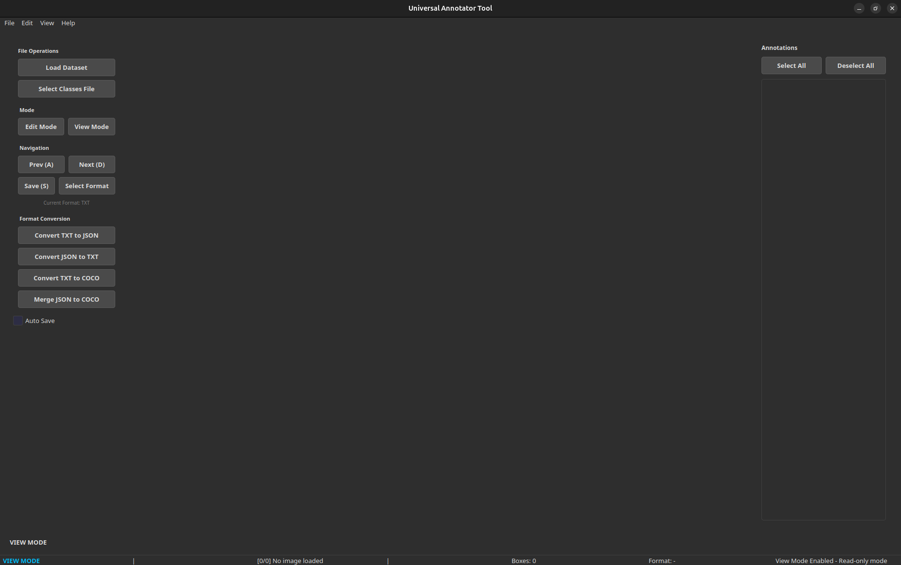
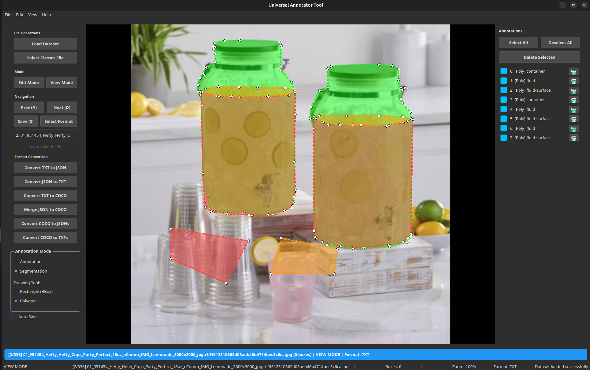

## Warning 
⚠️ Note: Use the main branch to access the tool. The dev branch is under active development and testing and may be unstable.

# Universal Annotator

A professional, modern, and powerful image annotation tool designed for creating bounding box annotations with maximum efficiency. It supports multiple formats, features an intelligent and rich user interface, and is packed with advanced features like nested annotations and extensive keyboard shortcuts.





## Key Features

### Core Features
- **Multiple Export Formats**: Save annotations in **TXT**, **JSON**, and **COCO** formats.
   - Converters and exporters now use dedicated output folders by default (for example: `converted_txt/`, `converted_json/`, `converted_coco_json/`) to avoid overwriting root label files.
- **Dual Annotation Modes**:
    - **Annotation Mode (Object Detection)**: Standard bounding box annotation.
    - **Segmentation Mode (Polygon)**: Create precise polygon annotations for semantic segmentation tasks.
- **Three-Tier View System**:
    - **Edit Mode (E)**: For interactively moving and resizing existing boxes and polygons.
    - **Draw Mode (M)**: For creating brand-new annotations.
    - **View Mode (X)**: A read-only mode for safe reviewing.
- **Advanced Editing**: Interactively move, resize, and reshape any bounding box or polygon using intuitive drag handles.
- **Instant Class Editing**: Double-click any annotation on the canvas or in the side list to instantly change its class label.
- **Nested Annotations**: Create bounding boxes inside existing ones, perfect for annotating objects within objects.
- **Intelligent Image Sorting**: Uses natural sorting to correctly order files like `image_2.jpg` before `image_10.jpg`.
- **Selection Memory**: Remembers which bounding boxes were selected for each image, restoring them when you navigate back.
- **Auto-Save**: Automatically saves your work when you move to the next or previous image, preventing data loss.
- **Format Auto-Detection**: Automatically detects the annotation format from existing label files in the selected directory.
- **JSON Class Discovery**: Intelligently scans your JSON files to discover class names, prompting you to confirm and apply them automatically.

- **Create Label Files**: When loading a dataset with an empty label folder, the app automatically offers to create label files in your chosen format (TXT, JSON, or COCO).

### UI Features 
- **Professional Dark Theme**: A beautiful dark theme for user comfort.
- **Mouse Wheel Zoom**: Zoom in and out of images effortlessly using the mouse wheel.
- **Complete Menu Bar**: A full menu bar provides access to all application features.
- **Rich Status Bar**: Get real-time feedback on the current image, box count, annotation format, and operational mode.
- **Comprehensive Help System**: An in-app help dialog (**F1**) provides a getting started guide, a full list of keyboard shortcuts, and annotation tips.
- **Informative Tooltips**: Hover over any button or control to see a helpful tooltip explaining its function.
- **Extensive Keyboard Shortcuts**: Designed for power users to annotate quickly and efficiently without relying on the mouse.

## Installation

### 1. (Recommended) Create a Virtual Environment
```bash
python3 -m venv venv
source venv/bin/activate  # On Windows: venv\Scripts\activate
```

### 2. Install Dependencies
```bash
pip install -r requirements.txt
```

### 3. Run Application
```bash
python app.py
```

## Usage

### Basic Workflow

1. **Load Data**
   - Click **"Load Dataset"** to select your image and label folders.
   - The annotation format is auto-detected. If no labels exist, you can select a format manually.
   - By default, the app supports JPG, PNG, BMP, TIFF, and WebP image formats.
   - By default, the app looks for label files in the selected label folder that match the image filenames. The Default format is TXT.
   - you can change the format later if needed.

2. **Annotate Images (Object Detection)**
   - Press **M** to enter **Draw Mode** (status bar turns green).
   - Make sure "Annotation" mode is selected in the left panel.
   - Click and drag on the image to draw a bounding box.
   - Select the appropriate class from the dialog that appears.
   - Use **A/D** or the **Previous/Next** buttons to navigate between images.

3. **Annotate Images (Segmentation)**
   - Press **M** to enter **Draw Mode**.
   - Select **"Segmentation"** mode in the left panel.
   - **Left-Click** on the canvas to add point vertices.
   - **Right-Click** or press **Enter** to close the polygon.
   - Press **Esc** to cancel drawing.
   - Select the class from the dialog.

4. **Edit Annotations**
   - Press **E** to enter **Edit Mode** (status bar turns orange).
   - Click inside any box or polygon and drag to move it.
   - Drag the blue 12px handles to resize bounding boxes or reshape polygons.
   - **Double-click** any annotation to change its class.
   - Press **Delete** to remove selected annotations.

5. **Save Your Work**
   - Press **S** to save manually.
   - Enable the **"Auto Save"** checkbox to save automatically every time you switch images.
   - The status bar will confirm when annotations are saved.

### Supported Annotation Formats

#### TXT Format (.txt files)
**Object Detection (YOLO Format):**
```
<class_id> <x_center> <y_center> <width> <height>
0 0.5 0.5 0.3 0.4
```
**Segmentation (YOLO-Seg Format):**
```
<class_id> <x1> <y1> <x2> <y2> <x3> <y3> ...
0 0.1 0.1 0.2 0.3 0.4 0.5 ...
```
Note: TXT files use normalized coordinates (0..1 range).

#### JSON Format
```json
{
  "annotations": [
    {
      "label": "class_name", 
      "bbox": [x, y, w, h], 
      "classId": 0
    },
    {
      "label": "class_name",
      "contour": [[x1, y1], [x2, y2], ...],
      "classId": 1
    }
  ]
}
``` 
Note: The JSON loader is highly flexible. It automatically detects and parses various structures, including `objects` or `annotations` arrays. It handles both `bbox` (boxes) and `contour` (polygons).

#### COCO Format
Standard COCO dataset format with images and annotations arrays.

## Configuration

### Classes
Edit `sample_classes/classes.txt` (or create your own) to define annotation classes.

### Keyboard Shortcuts
- **D** - Next Image
- **A** - Previous Image
- **S** - Save 
- **E** - Edit Mode (move/resize existing)
- **M** - Draw Mode (create new)
- **X** - View Mode (read-only)
- **Delete** - Delete selected annotation
- **Esc** - Cancel draw / View Mode / Exit
- **F1** - Help Dialog

### Default Settings
Edit `utils/config.py` for:
- Default colors
- Line widths
- Application name and version

## Converters & Export Folders

- By default conversion commands write outputs into a `converted_*` subfolder in the same label/input folder. Examples:
   - TXT conversion output → `converted_txt/`
   - JSON conversion output → `converted_json/`
   - COCO merge/convert output → `converted_coco_json/_annotations.coco.json`

- This prevents accidental creation or overwriting of a root-level `_annotations.coco.json` unless you explicitly save/export to the label folder.

## Notes about COCO files

- The application uses a single COCO JSON file structure when saving/loading COCO datasets. Converter utilities create a `converted_coco_json/_annotations.coco.json` by default. The app may also create or update a `_annotations.coco.json` in a label folder when saving annotations in COCO mode or when using certain exporters — be aware of which folder you are saving to if you want to keep converted outputs separated.

## Documentation

- **[UI_IMPROVEMENTS.md](UI_IMPROVEMENTS.md)**: Complete UI feature guide
- **[CONTRIBUTING_UI.md](CONTRIBUTING_UI.md)**: Development and contribution guide
- **Help Dialog (F1)**: In-app help with shortcuts and tips

## Troubleshooting

### Images not loading
- Verify image folder path
- Ensure files are supported formats (JPG, PNG, BMP)
- Check file permissions

### Labels not found
- Select annotation format manually
- Ensure label files are in selected folder
- Verify label filenames match image filenames

### Keyboard shortcuts not working
- Ensure application window has focus
- Check Edit/View mode is appropriate
- Verify shortcuts aren't conflicting with system shortcuts

## System Requirements

- Python 3.7+
- PyQt5 5.12+
- OpenCV 4.0+
- NumPy

## Dependencies

See `requirements.txt` for complete list:
- PyQt5: GUI framework
- opencv-python: Image processing
- numpy: Numerical operations

## Performance Tips

- Use images with reasonable resolution (1920x1080 or less)
- Disable unnecessary overlays in View mode
- Enable auto-save to reduce manual saving
- Use keyboard shortcuts for faster workflow
- Clear selections to reduce visual clutter

## Supported Image Formats

- JPEG (.jpg, .jpeg)
- PNG (.png)
- BMP (.bmp)
- TIFF (.tiff, .tif)
- WebP (.webp)

## Known Limitations

- Sub-pixel precise polygon editing is not currently supported (vertices snap to image pixels).

## Future Enhancements

- Keyboard shortcut customization
- Additional export formats
- Batch annotation tools
- Statistics and analytics dashboard
- Undo/Redo functionality
- Plugin system

## Contributing

Contributions are welcome! Please see [CONTRIBUTING_UI.md](documentation/CONTRIBUTING_UI.md) for:
- Development setup
- Code style guidelines
- Component development
- Testing procedures
- Pull request guidelines

## License

THIS SOFTWARE LICENSE IS PROVIDED "ALL CAPS" SO THAT YOU KNOW IT IS SUPER SERIOUS AND YOU DON'T MESS AROUND WITH COPYRIGHT LAW BECAUSE YOU WILL GET IN TROUBLE HERE ARE SOME OTHER BUZZWORDS COMMONLY IN THESE THINGS WARRANTIES LIABILITY CONTRACT TORT LIABLE CLAIMS RESTRICTION MERCHANTABILITY. NOW HERE'S THE REAL LICENSE:

It's a public domain.
Do whatever you want with it.

## Support

- **Report Bugs**: Open an issue with steps to reproduce
- **Suggest Features**: Use feature request template
- **Ask Questions**: Check documentation and Help dialog first

## Credits

Built with:
- PyQt5 - GUI Framework
- OpenCV - Image Processing
- NumPy - Numerical Computing

## Version

Current Version: 1.0.0

Last Updated: November 2025

## Author 
Madan Mohan Jha